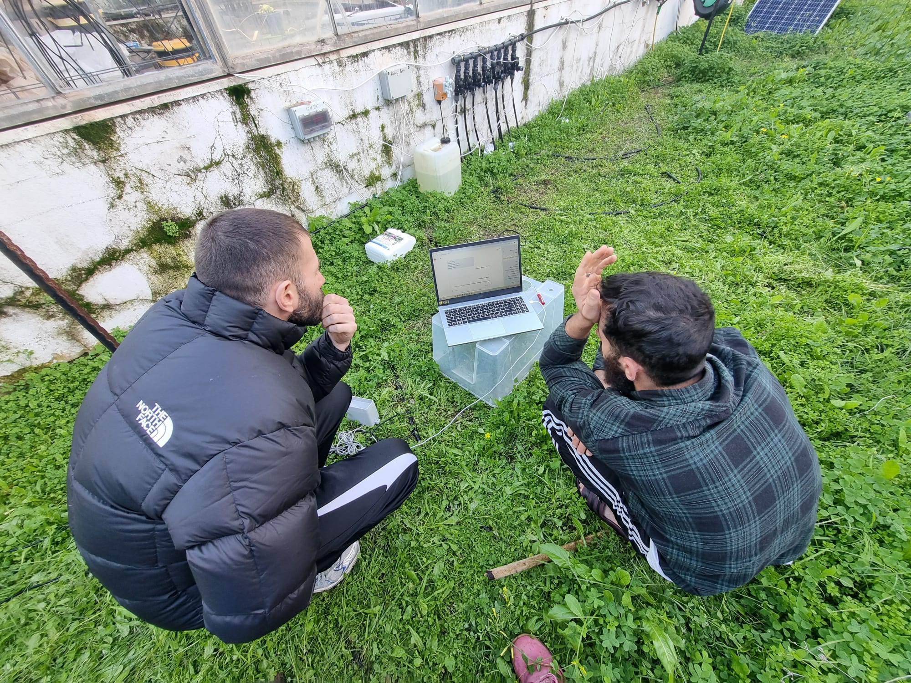
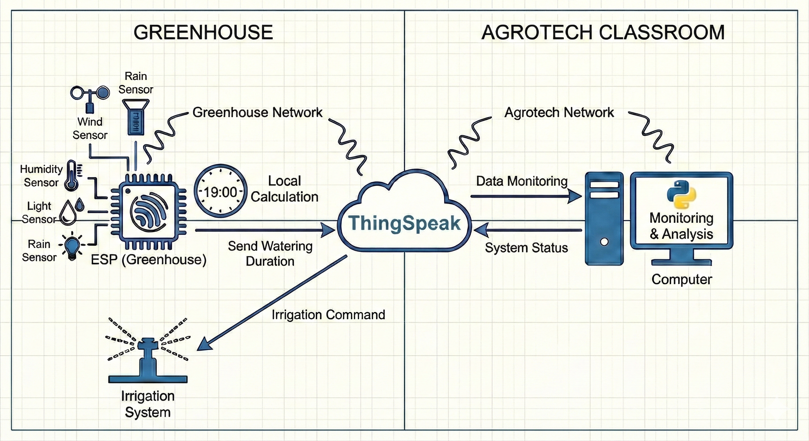
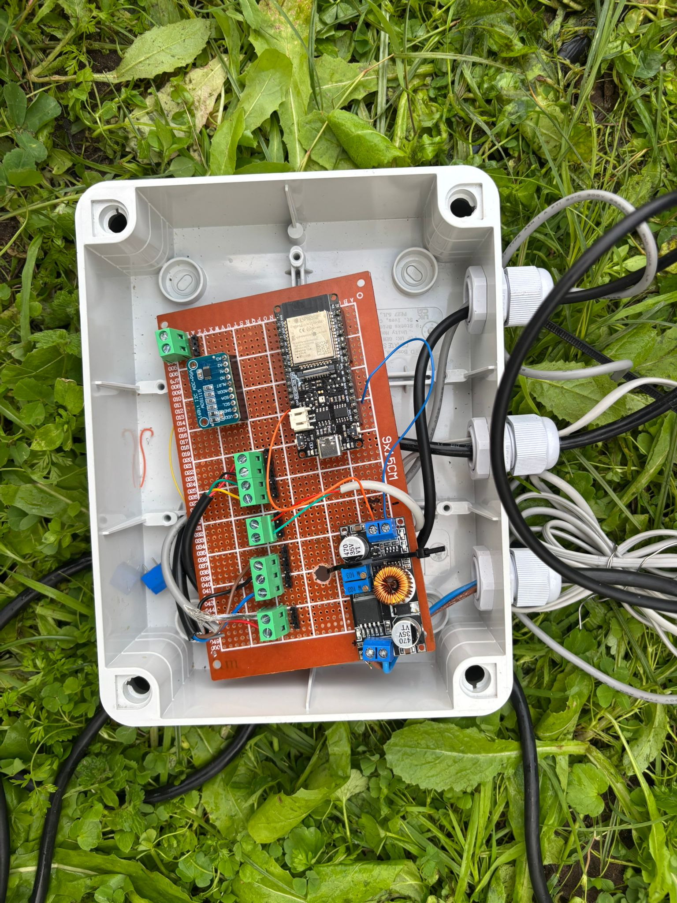
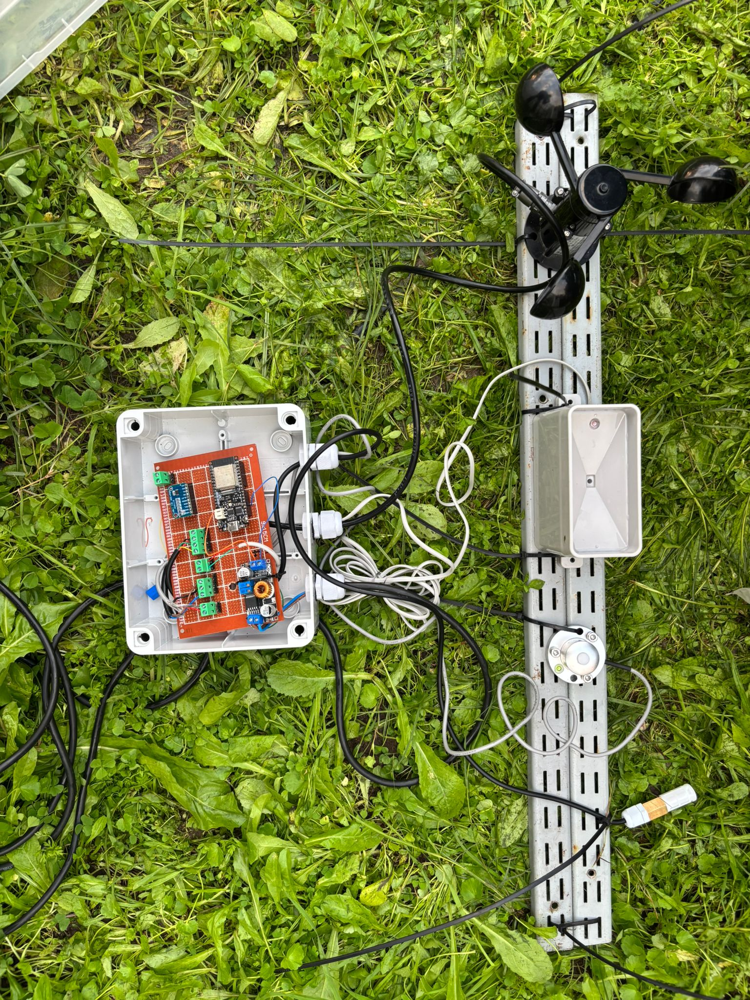
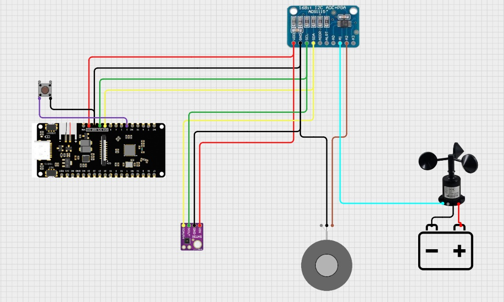

# Smart Irrigation System (Penman-Monteith) 💧🌱

## Project Overview
This project implements an autonomous irrigation system designed to optimize water usage based on real-time climatic conditions. Unlike traditional time-based controllers, our system calculates the exact water requirements using the **Penman-Monteith evapotranspiration equation ($ET_0$)**.

The system collects environmental data via sensors, processes the calculations on a remote server (Python), and controls the irrigation valves automatically to maintain a perfect water balance for the plants.

## System Architecture ⚙️
The system operates in a closed loop between the greenhouse and the classroom server:

1.  **Data Collection:** An **ESP32** microcontroller in the greenhouse reads data from environment sensors (Wind, Rain, Temp, Humidity, Radiation).
2.  **Cloud Upload:** The raw data is sent to **ThingSpeak** cloud platform via WiFi. https://thingspeak.mathworks.com/channels/3229286
3.  **Data Processing:** A **Python script** running on a computer (Agrotech Classroom) fetches the raw data and calculates the daily Evapotranspiration ($ET_0$).
4.  **Decision Making:** The calculated irrigation duration is sent back to ThingSpeak (via MQTT). https://thingspeak.mathworks.com/channels/3229296
5.  **Execution:** Every day at **19:00**, the ESP32 retrieves the command and activates the irrigation system accordingly.

## The Algorithm: Penman-Monteith
We use the standard FAO-56 Penman-Monteith equation to calculate reference evapotranspiration ($ET_0$):

$$ET_0 = \frac{0.408\Delta(R_n - G) + \gamma \frac{900}{T + 273} u_2 (e_s - e_a)}{\Delta + \gamma(1 + 0.34 u_2)}$$

Where:
* $R_n$: Net radiation
* $G$: Soil heat flux density
* $T$: Mean daily air temperature
* $u_2$: Wind speed at 2m height
* $e_s - e_a$: Vapor pressure deficit
* $\Delta$: Slope of the vapor pressure curve
* $\gamma$: Psychrometric constant

## Hardware Components 🛠️
The monitoring station is installed at a height of **2 meters** for accurate meteorological readings.

* **Microcontroller:** ESP32 Development Board
* **ADC Module:** ADS1115 (16-Bit) 
* **Temperature & Humidity:** SHT31 Sensor 
* **Wind Speed:** Anemometer (measured at 2m). gets 12V from greenhouse panel.
* **Rain Gauge:** Tipping Bucket mechanism (0.5mm resolution)
* **Solar Radiation:** Pyranometer / Light Sensor
* **Actuator:** Relay Module & Water Pump (via MQTT)

## Wiring Diagram

## Software Stack 💻
* **Firmware:** C++ (Arduino IDE) for ESP32 sensor management and MQTT communication.
* **Backend Analysis:** Python script for retrieving data and performing the complex math ($ET_0$ calculation).
* **Cloud Platform:** ThingSpeak (Data logging and MQTT broker).

## How to Run
1.  **ESP32:** Upload the `.ino` code from the `src` folder to the board. Ensure WiFi credentials and ThingSpeak API keys are configured.
2.  **Python Server:** Run the analysis script on a computer with internet access. The script should be scheduled to run before 19:00 daily.
